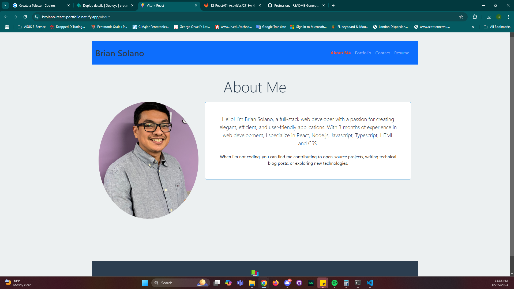

# React Portfolio

## Table of Contents
- [Description](#description)
- [Installation](#installation)
- [Usage](#usage)
- [Deployed-Link](#deployed-link)
- [License](#license)
- [Contributing](#contributing)
- [Credits](#credits)
- [Questions](#questions)
- [React+Vite](#react-+-vite)

## Description
Brian Solano's portfolio that leverages React to display brief content about my skills and offers a way for future employers to contact me. Also provides access to the most updated resume version if desired.

## Installation
npm run i && npm run dev

## Usage
To demonstrate how componenets can be used to maximize clean code whilst keeping it all dynamic and personalized.

## Deployed Link

Deployed Link: (https://brolano-react-portfolio.netlify.app/about)

## License

This project is licensed under the MIT license. For more information, see [MIT License](https://opensource.org/licenses/MIT).

## Contributing
By adding comments to source code

## Credits
Brian Solano https://github.com/brolano

## Questions
If you have any questions, you can contact me at [brian_solano110012@yahoo.com](mailto:brian_solano110012@yahoo.com).

## React + Vite

This template provides a minimal setup to get React working in Vite with HMR and some ESLint rules.

Currently, two official plugins are available:

- [@vitejs/plugin-react](https://github.com/vitejs/vite-plugin-react/blob/main/packages/plugin-react/README.md) uses [Babel](https://babeljs.io/) for Fast Refresh
- [@vitejs/plugin-react-swc](https://github.com/vitejs/vite-plugin-react-swc) uses [SWC](https://swc.rs/) for Fast Refresh
